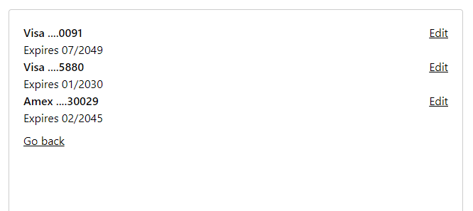

# Modal Modus

A routable modal demo.

Given a list of credit cards, the demo shows off how to

- Open a modal card index at /cards
- Route to a given credit card by ID, e.g. /cards/3
- Re-route back to a card index at /cards
- Close the modal by hitting "Go back"

All state management is handled in the browser by React router, allow a user to
re-route to a given page without losing their position after refreshing the browser.

## Getting started

1. Pull this repo
2. `npm install`
3. `make run`

Your browser should then open the app at <localhost:3000>
